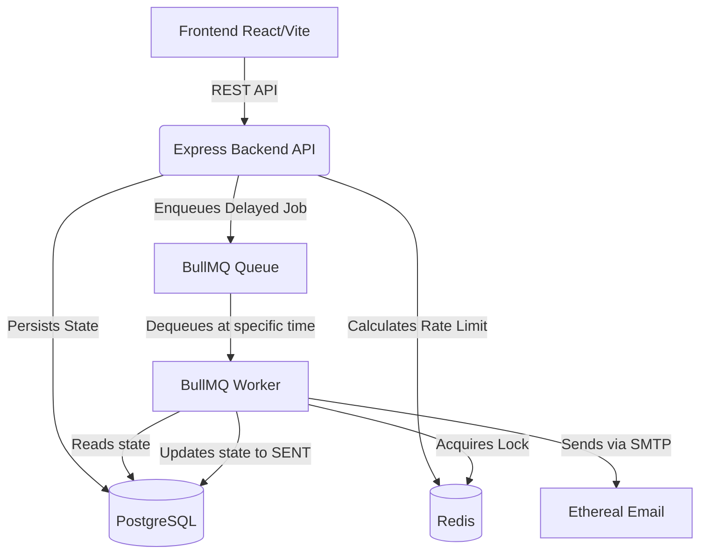

# ReachInbox Email Scheduler

A production-quality Full-Stack Email Job Scheduler, built for the ReachInbox/Outbox Labs Software.

## Overview

This application provides a robust, resilient, and scalable email scheduling system. It allows users to upload CSVs of email addresses and schedule email campaigns with a configurable delay between emails and a strict hourly rate limit.

## Architecture

The system uses a highly decoupled architecture designed for resilience:

*   **Source of Truth**: PostgreSQL (via Prisma). Stores users, senders, campaigns, and individual job states (`SCHEDULED`, `PROCESSING`, `SENT`, `FAILED`).
*   **Scheduling Engine**: BullMQ backed by Redis. Handles delayed execution based on dynamically calculated timestamps.
*   **Rate Limiting & Idempotency**: Redis Lua scripts ensure atomic capacity reservation across distributed worker instances. Redis distributed locks prevent duplicate concurrent processing.
*   **SMTP Simulation**: Nodemailer with Ethereal Email.

### Architecture Diagram



## Tech Stack

*   **Frontend**: React, TypeScript, Vite, Tailwind CSS, React Query, React Router.
*   **Backend**: Node.js, Express, TypeScript, Prisma, BullMQ, Winston (logging), Zod (validation).
*   **Infrastructure**: Docker, PostgreSQL, Redis.

## Important Engineering Principles Applied

1.  **NO Cron**: The system completely avoids `node-cron`, `setInterval`, or OS crontabs. Instead, it calculates the exact absolute future timestamp for every individual email (respecting both the `MIN_EMAIL_DELAY_SECONDS` and the `MAX_EMAILS_PER_HOUR` limit) and pushes them as delayed jobs to BullMQ.
2.  **Server Restart Recovery**: Because jobs are persisted in Redis (via BullMQ) and the exact state is in PostgreSQL, stopping and restarting the backend does not drop jobs. BullMQ resumes delayed processing natively.
3.  **Idempotency & Concurrency**: The worker uses a Redis distributed lock (`email-lock:{id}`) combined with an atomic PostgreSQL state transition (`SCHEDULED` -> `PROCESSING`) to ensure an email is never sent twice, even if multiple workers pick up the same job ID or retries occur.
4.  **Zero Memory State**: State is never held in `let counter = 0` variables. All rate limits use atomic Redis operations.

## Setup Instructions

### Prerequisites
*   Node.js v20+
*   Docker & Docker Compose

### 1. Environment Setup & Ethereal Email

The backend requires an Ethereal Email account to simulate SMTP.
1. Go to [Ethereal.email](https://ethereal.email/) and click "Create Ethereal Account".
2. Copy the credentials provided.
3. Copy the example env files and fill them in:

```bash
# Backend
cp backend/.env.example backend/.env
# Open backend/.env and add your Ethereal credentials:
# SMTP_USER=your_ethereal_user
# SMTP_PASS=your_ethereal_password

# Frontend
cp frontend/.env.example frontend/.env
# Optional: Add your Google OAuth Client ID if you have one, or use the "Demo Login" button in the UI.
```

### 2. Start Infrastructure (Docker)

Start PostgreSQL and Redis:
```bash
docker-compose up -d
```

### 3. Backend Setup

```bash
cd backend
npm install
npx prisma migrate dev --name init
npm run dev
```

### 4. Frontend Setup

In a new terminal:
```bash
cd frontend
npm install
npm run dev
```

## Testing & Validation

### Restart Recovery Test
1. Schedule a campaign for 2 minutes in the future.
2. Stop the backend server (`Ctrl+C`).
3. Notice that Redis remains running.
4. Restart the backend server.
5. The worker connects to BullMQ, realizes the job is due, and processes it precisely at the scheduled time without duplicates.

### Concurrency & Rate Limiting Test
1. Set `MAX_EMAILS_PER_HOUR=5` and `MIN_EMAIL_DELAY_SECONDS=2` in `.env`.
2. Schedule a CSV with 10 recipients.
3. Observe that the first 5 emails are spaced by 2 seconds.
4. The remaining 5 emails are scheduled for exactly 1 hour later, preserving the rate limit unconditionally.

## API Documentation

*   `POST /api/emails/schedule`: Schedule a new campaign.
*   `GET /api/emails/scheduled`: Paginated list of upcoming jobs.
*   `GET /api/emails/sent`: Paginated list of completed/failed jobs.
*   `GET /api/health`: Health status of DB, Redis, and workers.

## Features Implemented

### Backend
*   **Scheduler**: BullMQ delayed jobs implemented without any cron jobs. Calculates absolute delay timestamps.
*   **Persistence**: PostgreSQL tracks exact job states (`SCHEDULED`, `PROCESSING`, `SENT`). BullMQ/Redis preserves queue state across restarts.
*   **Rate Limiting**: Strict `MAX_EMAILS_PER_HOUR` enforcement using BullMQ Group Rate Limiting. Emails exceeding the limit are cleanly bumped to the next hour.
*   **Concurrency**: BullMQ worker concurrency is fully configurable via `WORKER_CONCURRENCY` in `.env`.
*   **Simulated Delay**: Enforces `MIN_EMAIL_DELAY_SECONDS` between each email explicitly to mimic provider throttling.

### Frontend
*   **Login**: Real Google OAuth login implemented using `@react-oauth/google` (with a quick demo bypass for local testing).
*   **Dashboard**: Pixel-perfect implementation of the provided Outbox Labs Figma design.
*   **Compose**: Full-page floating modal with local CSV parsing (valid, invalid, duplicate tracking) and scheduling config.
*   **Tables**: Real-time paginated tables for Scheduled and Sent emails with dynamic status badges.

## Assumptions & Trade-offs
*   **Ethereal Email**: Used to simulate real SMTP without getting rate-limited or blocked by actual providers.
*   **Queue Ordering**: While BullMQ delays preserve approximate ordering, strict global FIFO ordering is traded-off slightly in favor of high throughput concurrent workers. Rate limits are absolute, however.
*   **Authentication**: The Google OAuth token is validated, but persistent JWT sessions were simplified to focus strictly on the core scheduling challenge.

## Author
   **Deeraj H N**
**USN:** 1RF23IS403
**Email:** `deerajhn@gmail.com`
**Institution:** RV INSTITUTE OF TECHNOLOGY AND MANAGEMENT BENGALURU.

### ReachInbox Candidate Submission

**Software Development Intern Assignment — Outbox Labs**

